3. executer un serveur web :

a. recupere l'image sur le docker hub :
sudo docker pull nginx
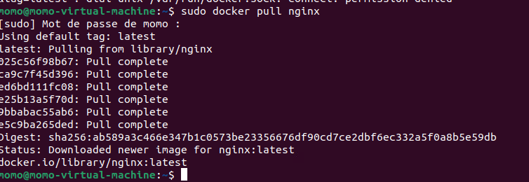

b. utiliser une commande pour verifier que vous disposez bien de l'image en local :
sudo docker images ls
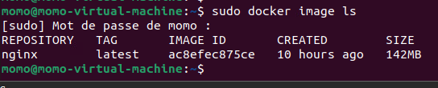

c. creer un ficher dans votre repos local contenant "hello world" :
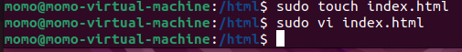
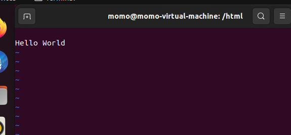

d. demarrer un nouveau container et servir la page html :

e. supprimer le container :
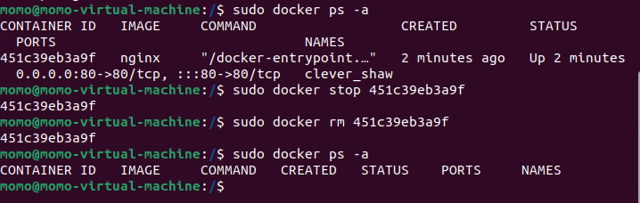

f. relancer le meme container sans l'option -v puis utiliser la commande cp pour servir votre fichier :
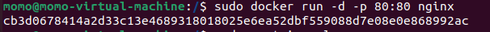
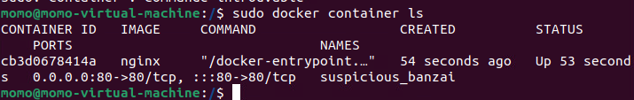
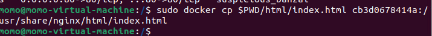
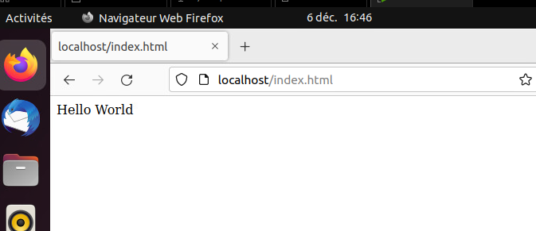

4. build une image :

a. a l'aide d'un dockerfile, creer une image qui permet d'executer un serveur web
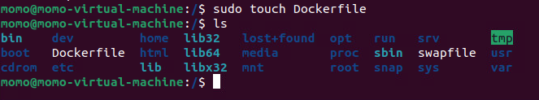
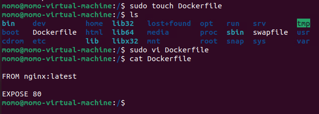
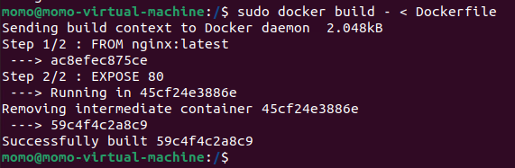
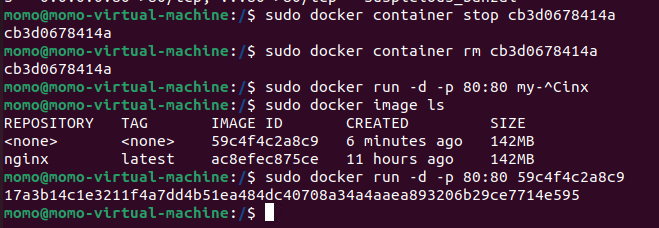

b. executer cette nouvelle image de maniere a servir ./html/index.html
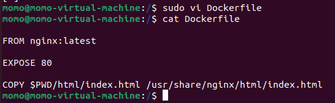

c. quelles différences observez--vous entre les questions 3. et 4.., trouvez les avantages & inconvenients de chque procédure