3. Executer un serveur web :

a. Recupere l'image sur le docker hub :
sudo docker pull nginx

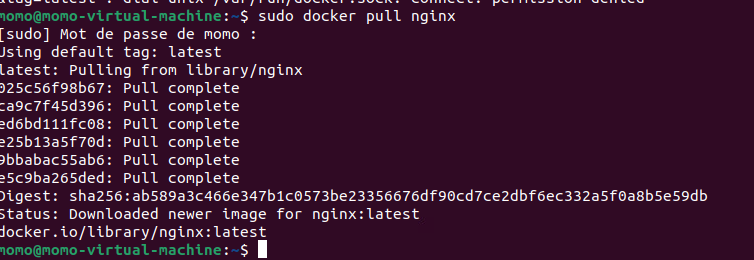

b. Utiliser une commande pour verifier que vous disposez bien de l'image en local :
sudo docker images ls

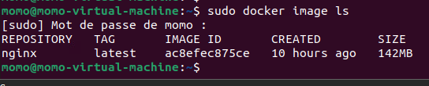

c. Creer un ficher dans votre repos local contenant "hello world" : 

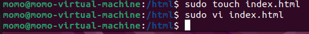

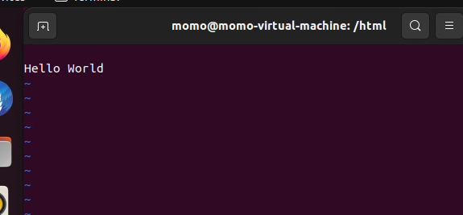

d. Demarrer un nouveau container et servir la page html :

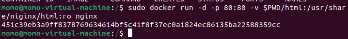

e. Supprimer le container : 

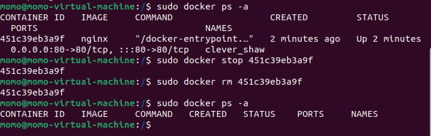

f. Relancer le meme container sans l'option -v puis utiliser la commande cp pour servir votre fichier :

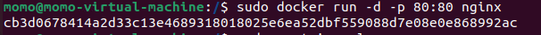

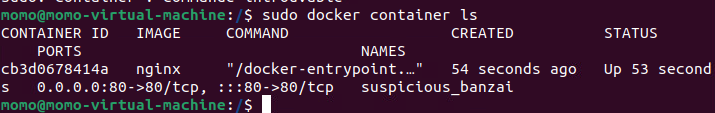

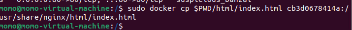

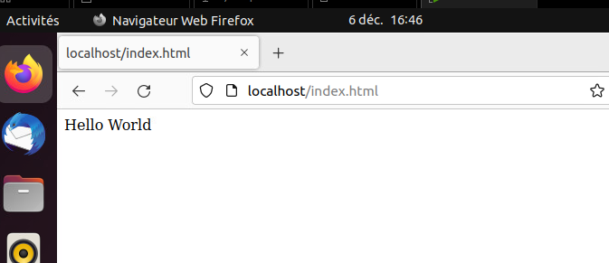

4. Build une image :

a. A l'aide d'un dockerfile, creer une image qui permet d'executer un serveur web :

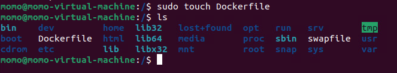

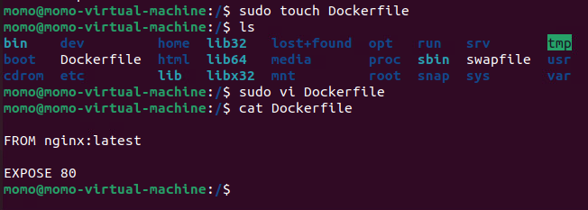

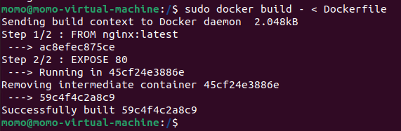

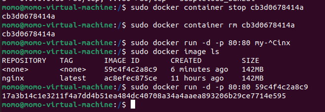

b. Executer cette nouvelle image de maniere a servir ./html/index.html :

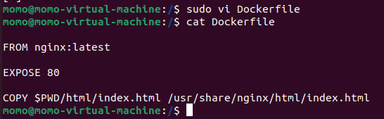

c. Quelles différences observez--vous entre les questions 3. et 4.., trouvez les avantages & inconvenients de chque procédure

En creant une image avec un dockerfile on peut avoir un controle plus fin sur l'image que l'on va creer, on peut par exemple ajouter des variables d'environnement, des commandes, des fichiers de configuration, etc.

5. Utiliser une base de données dans un container docker :

a. Recuperer les images mysql(ou mariadb) et phpmyadmin/phpymyadmin depuis le Docker Hub :

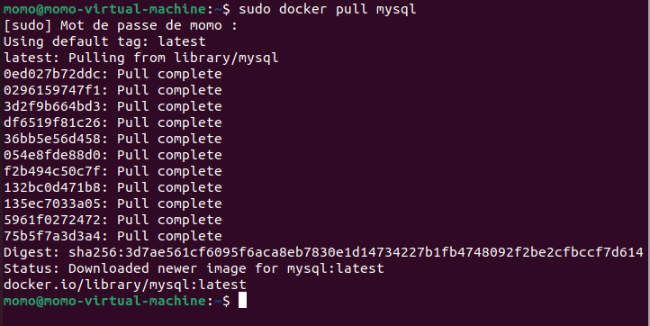

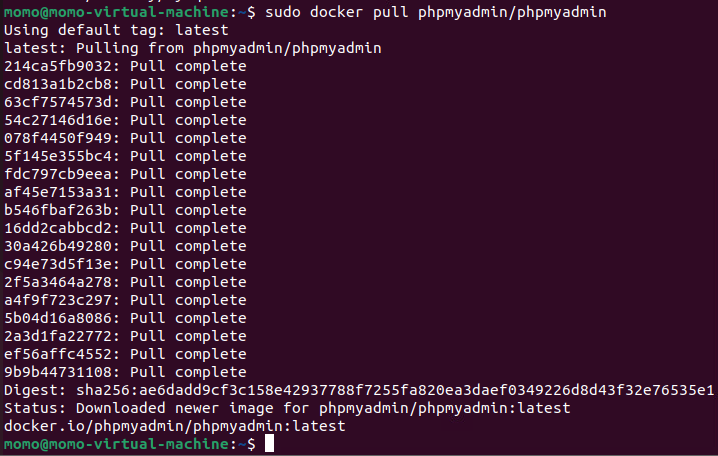

b. Executer 2 containers à partirdes images, ajouter une table et quelques lignes dans votre base via phpmyadmin :

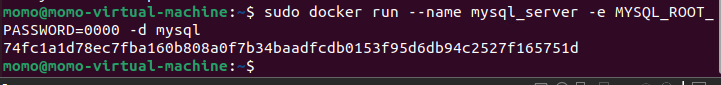

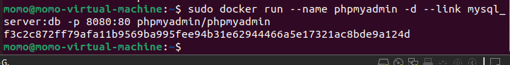

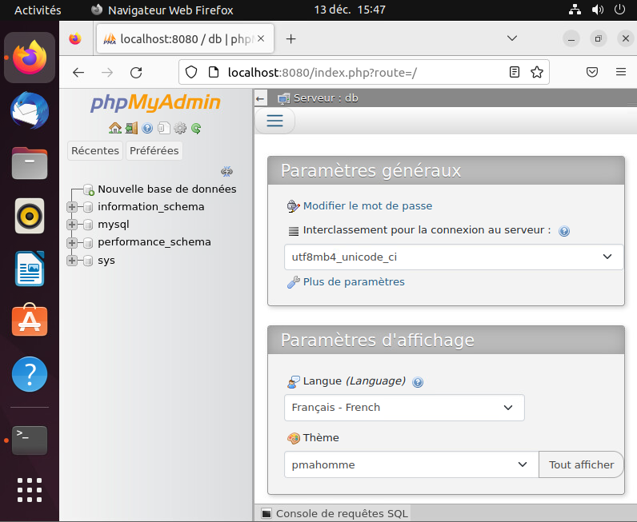

6. Utilisation de docker-compose.yml :

a. Aller lire la documentation de docker-compose et essayer de décrire à quoi sert cette commande VS la commande docker run :

Docker-compose est un outil qui permet de definir et de lancer des applications docker composees de plusieurs containers

b. Quelle commande permet de lancer tous les containers du fichier yaml ? Quelle commande permet de les stopper ?

La commande pour lancer : docker-compose up -d

La commande pour stopper : docker-compose down

c. Ecrivez un fichier docker-compose.yml pour servir votre base de données (mysql, mariadb et etc) et phpmyadmin :

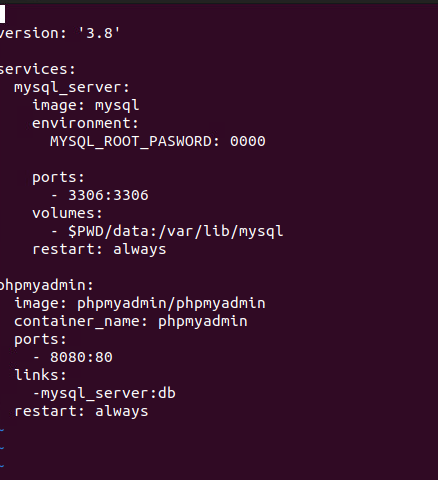

dans cette exemple on a 2 containers, le premier est un container mysql et le second est un container phpmyadmin

on peut retouver l'ensenble des configuration dans la commande docker run dans le fichier docker-compose.yml

pour acceder a phpmyadmin on utilise l'url http://localhost:8080