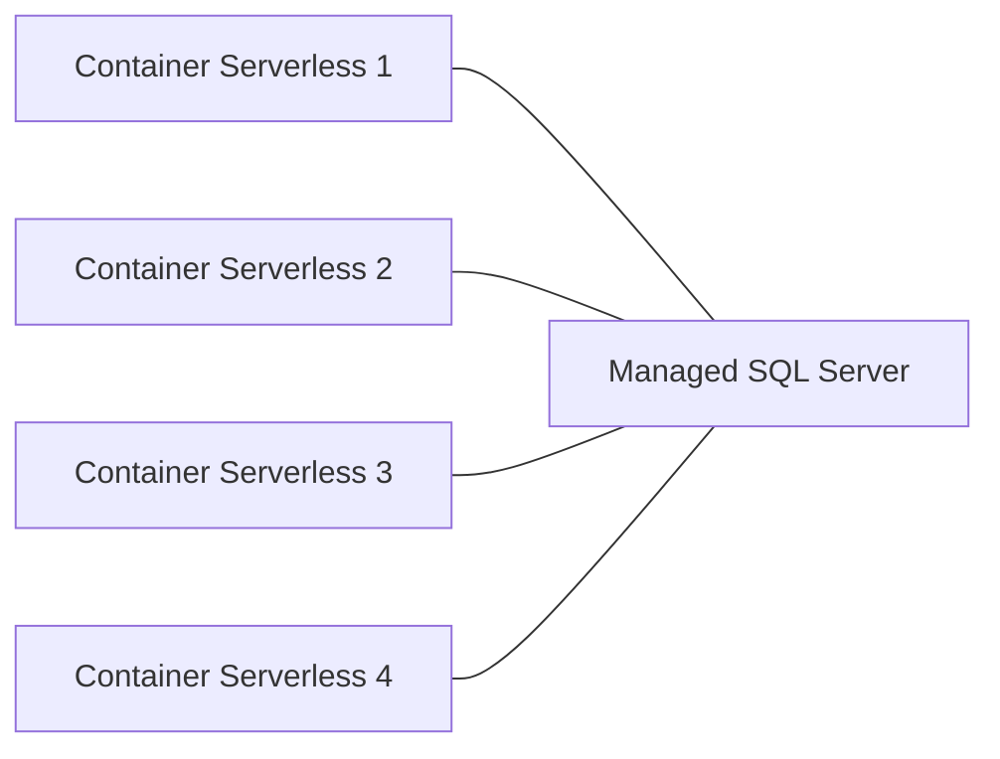

### Q1 - Pourquoi selon-vous est-il important que votre application soit stateless ?

1) Selon moi il est important que l’application soit stateless car cela répartie mieux la charge donc peut accepté plus de charge

### Q2 - Est-il possible de créer un volume et de le lier à ses containers serverless ?
2) Oui, il est possible de créer un volume et de le lier a des containers serverless.

### Q3 - Est-ce que ma base sqlite est partagée si plusieurs instances de mon application sont lancées ?
3) Non, la base sqlite n’est pas partagée si plusieurs instances de mon application sont lancées.

### Q4 - Comparez le coût d'une application déployée en mode Serverless VS déployée en mode classique (vm/serveur dédié)
4) Cela depend de l'utilisation que l'on a du serveur. En mode serverless, on paye seulement ce que l'on utilise. En mode classique, on paye le serveur même si on n'utilise pas le serveur.

### Q5 - Quels sont les points de vigilance/d'attention que vous pouvez déterminer d'un tel déploiement
5) Il faut bien choisir le type de serveur pour l'application. Il faut aussi bien choisir le type de base de données pour l'application.

### Q6 - Proposez une architecture (schéma) en utilisant des services Scaleway permettant de déployer votre application mais en utilisant une base de données dans le cloud (en partant du principe que vous allez avoir plusieurs instances de votre application)
6) 

### Q7 - pourquoi en serverless il faudrait utiliser une base de données dans le cloud ?
7) En serverless il faudrait utiliser une base de données dans le cloud car on ne peut pas partager une base de données entre plusieurs instances de l'application.

### Q8 - Quels sont les avantages et les inconvénients à déployer ses solutions en mode "full cloud" ?
8) Les avantages sont que l'on peut facilement augmenter la puissance du serveur. Les inconvénients sont que l'on paye le serveur même si on n'utilise pas le serveur.

### Q9 - Savez-vous si vos entreprises d'alternances actuelles utilisent des services cloud ? Si oui lesquels et dans quel but ?
9) Je ne sais pas si mon entreprise d'alternance utilise des services cloud