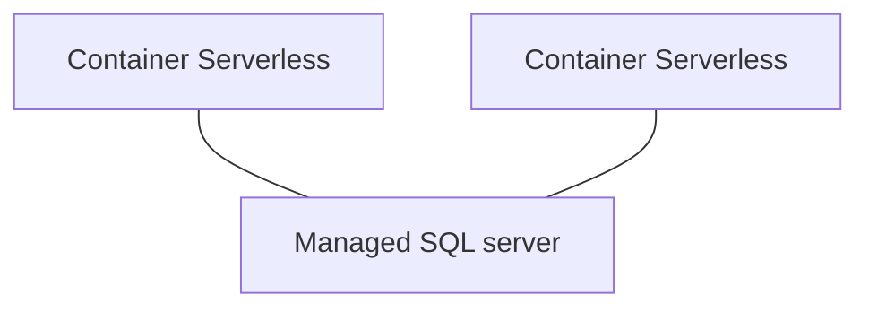

# TP serverless Scaleway - Questions

##Puig Baptiste B3 - CYBSEC

### Q1 - Pourquoi selon-vous est-il important que votre application soit stateless ?

1) Selon moi il est important que l’application soit stateless car cela répartie mieux la charge et permet d’accueillir plus de demandes et donc de supporter une charge plus importante.

### Q2 - Est-il possible de créer un volume et de le lier à ses containers serverless ?

Oui, il est possible de créer un volume et de le lier a des containers serverless. Il faut attacher le volume a une instance (4étapes sur scaleway).

### Q3 - Est-ce que ma base sqlite est partagée si plusieurs instances de mon application sont lancées ?

Non, car volumes de données ne peuvent être liées a 2 instances 

### Q4 - Comparez le coût d'une application déployée en mode Serverless VS déployée en mode classique (vm/serveur dédié)

Il revient plus cher de déployer une application en classique (vm/serveur dédiée), mais il est plus fiable et permet d’avoir la main sur toute l’architecture. Le cout sera plus faible mais la structure est plus rigide et l’intégrité,la disponibilité et la confidentialité des données peut être plus difficile à garantir dans le cas de l’utilisation de Scaleway.

### Q5 - Quels sont les points de vigilance/d'attention que vous pouvez déterminer d'un tel déploiement

Il faut être vigilant au volume de données utilisés, à la quantité de requêtes et il faut être vigilant aux instances utilisés si il y en a plusieurs avec plusieurs “versions”.

### Q6 - Proposez une architecture (schéma) en utilisant des services Scaleway permettant de déployer votre application mais en utilisant une base de données dans le cloud (en partant du principe que vous allez avoir plusieurs instances de votre application)

### Q7 - pourquoi en serverless il faudrait utiliser une base de données dans le cloud ?

Car la base de donnée doit être la meme pour tous le monde elle n’est jamais répliqué sur un instance spécifique.

### Q8 - Quels sont les avantages et les inconvénients à déployer ses solutions en mode "full cloud" ?

Avantages : 

- Le déploiement est très rapide.
- Le coût pour une utilisation “normale” est plus fait qu’host sois même son serveur
- Très facilement accessible grace à la plateforme et intuitif

Inconvénients :

- Peut engendrer des surcout
- Pertes de la main sur les données
- En cas de problèmes sur Scaleway nous sommes contraint d’attendre une intervention des techniciens de l’entreprises et ne pouvons pas dépanner nous-même

### Q9 - Savez-vous si vos entreprises d'alternances actuelles utilisent des services cloud ? Si oui lesquels et dans quel but ?

Mon entreprise actuelle (airbus) utilise des services clouds mais sans que les utilisateurs y aient accès (google professional ou cisco jabber).