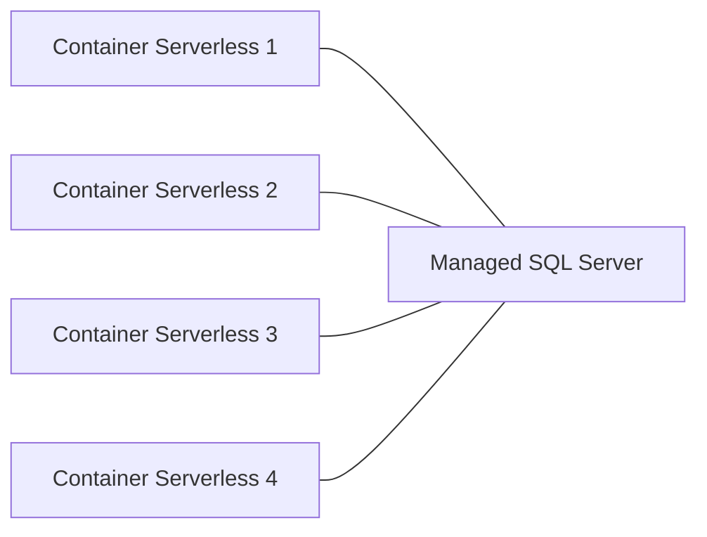

# Q1- Pourquoi selon-vous est-il important que votre application soit stateless ?

A1- Parce que cela permet de répartir les tâches sur plusieurs serveurs et ainsi de pouvoir gérer une charge plus importante.

# Q2 - Est-il possible de créer un volume et de le lier à ses containers serverless ?

A2- Oui, il est possible de créer un volume et de le lier à ses containers serverless. Mais il sagit d'un service payant qui n'est pas inclus par défaut dans le service serverless.

# Q3 - Est-ce que ma base sqlite est partagée si plusieurs instances de mon application sont lancées ?

A3- Non, la base sqlite n'est pas partagée si plusieurs instances de mon application sont lancées.

# Q4 - Comparez le coût d'une application déployée en mode Serverless VS déployée en mode classique (vm/serveur dédié)

A4- Le coût va dependre de l'utilisation. En mode serverless, on paye uniquement ce que l'on utilise. En mode classique, on paye un serveur dédié, même si on n'utilise pas tout le serveur. en termes de confidencialité, le mode serverless ne permet pas de grade la main sur c'est donnees.
Donc, en mode serverless, on paye moins cher.

# Q5 - Quels sont les points de vigilance/d'attention que vous pouvez déterminer d'un tel déploiement ?

A5- Les points de vigilance/d'attention que l'on peut déterminer d'un tel déploiement sont :

- La base de données n'est pas partagée entre les instances de l'application. 
- Le coût d'une application déployée en mode Serverless est plus élevé que celui d'une application déployée en mode classique.
- Il faut bien choisir le nombre de réplicas pour ne pas surcharger le serveur.

# Q6 - Proposez une architecture (schéma) en utilisant des services Scaleway permettant de déployer votre application mais en utilisant une base de données dans le cloud (en partant du principe que vous allez avoir plusieurs instances de votre application)

# Q7 - pourquoi en serverless il faudrait utiliser une base de données dans le cloud ?

En serverless il faudrait utiliser une base de données dans le cloud car la base de données n'est pas replique entre les instances de l'application.

# Q8 - Quels sont les avantages et les inconvénients à déployer ses solutions en mode "full cloud" ?

Les avantages à déployer ses solutions en mode "full cloud" sont :

- On paye uniquement ce que l'on utilise.
- On peut facilement augmenter ou diminuer la capacité de son serveur.

Les inconvénients à déployer ses solutions en mode "full cloud" sont :

- On ne peut pas avoir la main sur ses données.
- Peut engendrer des frais supplémentaires.
- Dans le cas d'une defaillance de l'ebergeur, on ne peut rien faire.

# Q9 - Savez-vous si vos entreprises d'alternances actuelles utilisent des services cloud ? Si oui lesquels et dans quel but ?

A9 - Oui, nous utilisons scaleway.